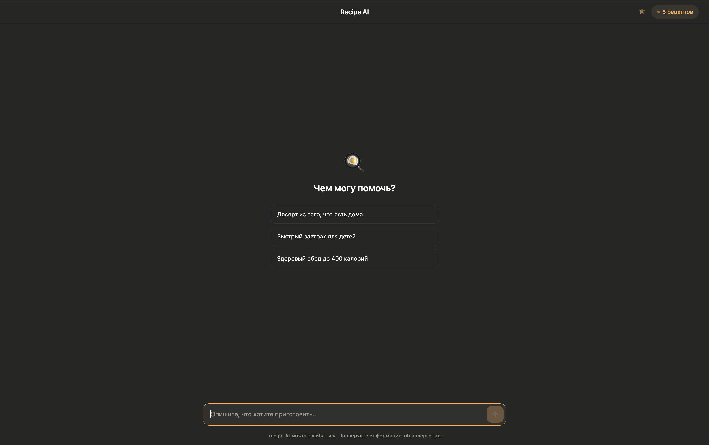
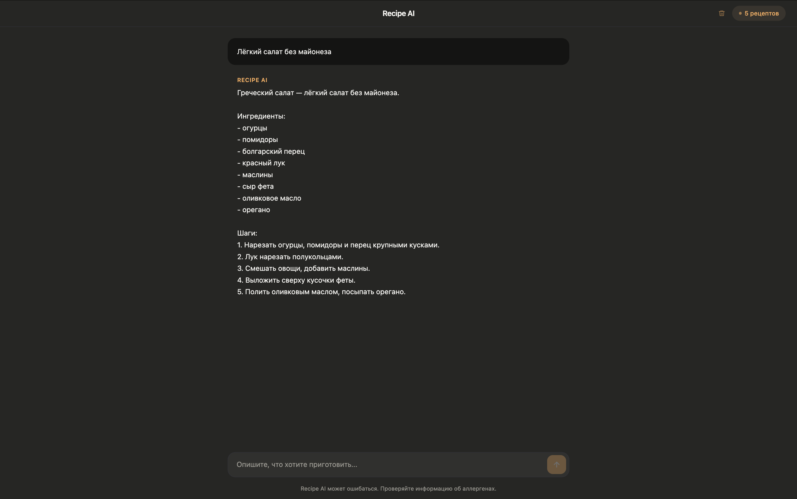
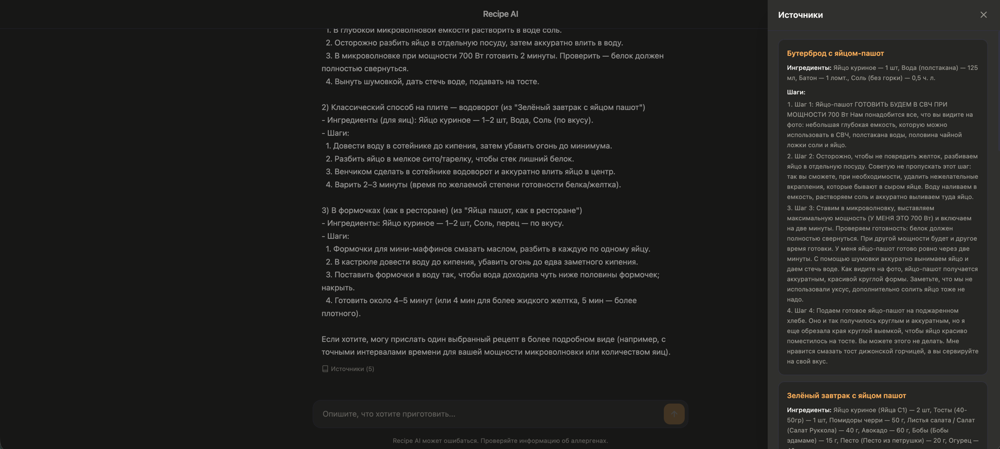

# Recipe AI

Чат-ассистент по рецептам, который отвечает на основе локальной базы рецептов, проиндексированной в Qdrant.

> Участники: \
> Горбатюк Олег \
> Кривулец Нина \
> Сюй София \
> Атанасоска София

[Дизайн документ](./docs/DESIGN.md)


[Отчет по INFRA](./docs/INFRA_REPORT.md)
[Отчет по MVP](./docs/MVP_REPORT.md)

# Визуал
## Что реализовано

- веб-интерфейс чата на React + Vite
- backend на FastAPI
- агент на LangChain с одним инструментом поиска по рецептам в Qdrant
- векторный поиск по двум локальным источникам рецептов
- отображение источников, на основании которых сформирован ответм
- локальное хранение истории переписки в браузере с шифрованием через Web Crypto API
- счётчик количества загруженных рецептов

## Что является фактическим заданием проекта

В репозитории реализован не полнофункциональный рекомендательный сервис с богатыми фильтрами, а рабочий MVP чат-ассистента по рецептам

Итоговая постановка задания для текущей реализации:

1. Собрать локальную базу рецептов из подготовленных JSON-файлов
2. Проиндексировать рецепты в Qdrant с помощью OpenAI embeddings
3. Реализовать чат, в котором LLM отвечает только на основе найденных рецептов
4. Показывать пользователю источники, использованные в ответе
5. Запускать систему целиком через Docker Compose

## Ограничения текущего MVP

- Нет UI-фильтров по времени, диете, калорийности и другим метаданным
- Нет отдельного этапа извлечения структурированных фильтров из запроса
- Нет автоматического обновления базы рецептов.

## Визуал





## Структура проекта

- `web/` — фронтенд на React.
- `api/` — FastAPI, агент, работа с Qdrant и скрипты индексации.
- `api/static/` — локальные JSON/CSV с рецептами.
- `docs/` — документация.
- `parsing/` — ноутбуки для парсинга исходных сайтов.

## Переменные окружения

Создайте `.env` в корне проекта. Обязательная переменная:

```env
OPENAI_API_KEY=...
```

Опционально можно задать:

```env
OPENAI_PROXY=...
OPENAI_CHAT_MODEL=gpt-5-mini
OPENAI_EMBEDDING_MODEL=text-embedding-3-small
QDRANT_COLLECTION=recipes
```

## Запуск

Поднять сервисы:

```bash
docker compose up --build -d
```

Остановить сервисы:

```bash
docker compose down
```

После запуска интерфейс доступен на `http://localhost:8000`.

## Загрузка рецептов в Qdrant

После старта контейнеров нужно отдельно загрузить рецепты в векторную базу:

```bash
docker compose exec api python scripts/fill_recipes.py
```

Полезные варианты:

```bash
docker compose exec api python scripts/fill_recipes.py --dry-run
docker compose exec api python scripts/fill_recipes.py --sources povarenok
docker compose exec api python scripts/fill_recipes.py --sources russianfood
docker compose exec api python scripts/fill_recipes.py --batch-size 50
```

Скрипт:

- читает `api/static/Povarenok_recipes.json` и `api/static/recipes_rf_.json`;
- преобразует рецепты к упрощённой схеме `title / ingredients / steps`;
- ограничивает загрузку первыми `10000` рецептами;
- добавляет документы в коллекцию Qdrant `recipes`.

## API

### `POST /api/chat`

Принимает историю диалога и возвращает:

- `answer` — текст ответа модели
- `sources` — рецепты, найденные через поиск и использованные агентом

### `GET /api/recipes/count`

Возвращает текущее число рецептов в коллекции Qdrant

## Как устроен ответ

1. Фронтенд отправляет историю сообщений на backend
2. Агент LangChain при необходимости вызывает инструмент `search_recipe`
3. Инструмент делает similarity search в Qdrant
4. Найденные рецепты передаются модели как контекст
5. Ответ и список использованных источников возвращаются в UI

## Дальнейшие улучшения

Логичное развитие текущего MVP:

1. добавить структурированные метаданные рецептов и фильтрацию
2. внедрить оценку качества retrieval и ответов
