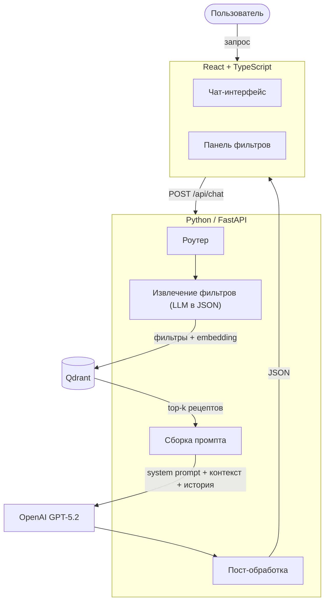

# Дизайн-документ

основан на
шаблоне [Reliable ML](https://github.com/IrinaGoloshchapova/ml_system_design_doc_ru/blob/main/ML_System_Design_Doc_Template.md)

---

## 1. Контекст проекта

### 1.1 Бизнес-задача

На кулинарных сайтах (Eda.ru, AllRecipes, "Поваренок") поиск работает через ключевые слова и фиксированные фильтры. Это
покрывает простые запросы вроде "рецепты с курицей", но ломается на чем-то сложнее: *"ужин из того, что обычно есть
дома, без глютена, за 40 минут"*. Такой запрос нельзя выразить набором галочек — нужно понимание контекста и умение
уточнять

Решение: чат-бот с RAG-архитектурой \
Гибридный поиск по базе рецептов (векторный + фильтры по метаданным) + LLM для ведения диалога. Бот ищет по базе, а не
придумывает — ответы привязаны к конкретным рецептам из базы знаний

**Критерии успеха:**

- Recall@5 $\ge$ 0.8 на тестовой выборке запросов (нужный рецепт в top-5)
- Faithfulness $\ge$ 0.9 по RAGAS (LLM не выдумывает ингредиенты/шаги)

### 1.2 Целевая аудитория

Люди, которые готовят дома — от "что приготовить из остатков" до "десерт без сахара для гостей". Отдельный сегмент —
люди с ограничениями в питании (аллергии, диеты), которым важна точная фильтрация по составу.

Канал — веб-приложение. Текстовый чат с поддержкой многотурового диалога: можно уточнять, просить замены ингредиентов,
задавать вопросы по выданному рецепту.

Нагрузка: учебный проект, единицы одновременных пользователей. Целевой latency — до 10 с.

### 1.3 Ограничения и допущения

**Не делаем:**

- Медицинские рекомендации — только дисклеймер
- Генерацию рецептов "из головы" — ответы строго из базы. Нет подходящего $\to$ говорим об этом
- Обработку изображений
- Ответы не по теме (off-topic rejection)

**Допущения:**

- Рецепты — публичные данные, отправка в OpenAI допустима.
- Основной язык — русский.
- База собирается один раз, обновление вручную.

**Риски:**

- Галлюцинации $\to$ строгий системный промпт + отображение источника.
- Некорректная информация об аллергенах $\to$ дисклеймер.

---

## 2. Архитектура решения

### 2.1 Общая схема



**Порядок обработки:**

1. Фронт отправляет текст + историю + активные UI-фильтры на `POST /api/chat`
2. Backend извлекает фильтры из текста отдельным LLM-вызовом ($\to$ JSON: `cook_time_max`, `diet_tags`,
   `exclude_ingredients` и т.д.). UI-фильтры мержатся с извлеченными
3. Текст запроса $\to$ эмбеддинг (`text-embedding-3-large`) $\to$ поиск в Qdrant с фильтрами по метаданным $\to$ top-5
   рецептов
4. Промпт: системная инструкция + найденные рецепты + последние N сообщений + текущий запрос $\to$ GPT-5.2
5. Пост-обработка (ссылки на источники, форматирование) $\to$ ответ на фронт

**Где что лежит:**

- Промпт-шаблоны: YAML в репозитории, под Git
- Qdrant: Docker-контейнер, данные на volume
- История диалога: в состоянии фронтенда, передается с каждым запросом, не персистится

### 2.2 Хранилище знаний

**Источники:** спаршенные рецепты с открытых сайтов и/или открытые датасеты (RecipeNLG, Food.com). Целевой объем 10–50K
рецептов

**Предобработка:**

- Парсинг $\to$ извлечение полей: название, ингредиенты, шаги, время, порции, калорийность.
- Нормализация ингредиентов (лемматизация, словарь синонимов).
- Теги (`meal_type`, `cuisine`, `diet_tags`) — по правилам или batch-классификация через LLM.
- Дедупликация по названию + совпадению ингредиентов.

**Индексация:** один рецепт = один документ в Qdrant. Текст для эмбеддинга:
`"{title}. Ингредиенты: {список}. {первые 2 шага}"`. Полный текст — в payload. Метаданные для фильтрации:
`cook_time_min`, `calories`, `cuisine`, `meal_type`, `diet_tags`, `ingredients_list`.

**Обновление:** скрипт. В рамках проекта: единоразовая сборка

### 2.3 Интеграции и интерфейсы

**Фронтенд (React + TypeScript + Vite):**

- Чат с рендерингом markdown
- Sidebar: слайдер времени, чекбоксы диет, выбор типа блюда
- Карточки рецептов: название, ингредиенты, ссылка на источник

**API (FastAPI):**

- `POST /api/chat`: запрос + история + фильтры $\to$ ответ

**Логирование:** каждый запрос $\to$ SQLite: текст, фильтры, ID рецептов, ответ, оценка. Для анализа провалов retrieval
и ошибок генерации.

### 2.4 Инфраструктура

| Компонент       | Технология                                 |
|-----------------|--------------------------------------------|
| Frontend        | React, TypeScript, Vite                    |
| Backend         | Python 3.11+, FastAPI, LangChain           |
| Векторная БД    | Qdrant (Docker)                            |
| Эмбеддинги      | OpenAI `text-embedding-3-large` (3072 dim) |
| LLM             | OpenAI GPT-5.2                             |
| Контейнеризация | Docker Compose                             |

**Среды:** dev - локально, Qdrant in-memory; prod - Docker Compose на сервере

**Вычисления:** эмбеддинги и генерация через API, GPU не нужен. Qdrant на 50K документов — десятки мегабайт на CPU.

**Безопасность:** ключи в `.env`, не в Git. Данные публичны, ПДн не обрабатываются

---

## 3. Данные и качество знаний

Рецепты: публичная информация, чувствительных данных нет. Отправка в LLM без ограничений.

### 3.1 Сбор и предобработка

**Источники:**

- A: парсинг сайтов (`Scrapy` / `BeautifulSoup`).
- B: открытый датасет (RecipeNLG ~2M, Food.com ~230K) — подмножество, при необходимости перевод.
- C: комбинация.

**Формат после обработки:**

```json
{
  "id": "rec_00142",
  "title": "Паста карбонара",
  "ingredients": [
    {
      "name": "спагетти",
      "amount": "400",
      "unit": "г"
    },
    {
      "name": "гуанчиале",
      "amount": "200",
      "unit": "г"
    },
    {
      "name": "яичный желток",
      "amount": "4",
      "unit": "шт"
    },
    {
      "name": "пекорино романо",
      "amount": "100",
      "unit": "г"
    }
  ],
  "steps": [
    "Отварить пасту...",
    "..."
  ],
  "cook_time_min": 25,
  "servings": 4,
  "calories_per_serving": 520,
  "cuisine": "итальянская",
  "meal_type": "обед",
  "diet_tags": [],
  "source_url": "https://eda.ru/...",
  "ingredients_flat": [
    "спагетти",
    "гуанчиале",
    "яичный желток",
    "пекорино романо"
  ]
}
```

**Pipeline:**

1. Парсинг / загрузка $\to$ структурированные поля.
2. Нормализация ингредиентов (лемматизация, единицы).
3. Расстановка тегов (правила / batch LLM).
4. Дедупликация (название + $\ge$80% ингредиентов).
5. Валидация, отсев мусора.
6. Сохранение в JSON.

### 3.2 Векторизация и индексирование

**Эмбеддинги:** OpenAI `text-embedding-3-large`, 3072 размерности

**Чанкинг:**

- MVP: один рецепт = один вектор. Текст: `"{title}. Ингредиенты: {список}. {шаги 1-2}"`.
- Эксперимент: раздельная индексация ингредиентов и шагов, агрегация на уровне рецепта. Сравнение по Recall@5.

**Qdrant-коллекция `recipes`:**

- Метрика: cosine.
- Payload: полный текст + все метаданные.
- Индексируемые поля: `cook_time_min` (int), `calories_per_serving` (int), `cuisine` (keyword), `meal_type` (keyword),
  `diet_tags` (keyword[]), `ingredients_flat` (keyword[]).

### 3.3 Метрики качества

**Покрытие:** тестовый набор 10-20 запросов с правильными ответами. Recall@5, цель $\ge$ 0.8.

**Проверка:**

- Ручная ревизия ~30 рецептов.
- Сложные-запросы: опечатки, размытые формулировки, конфликтующие фильтры.

## 4. Модель и генерация

### 4.1 Выбор LLM и промптинг

*Модель*: OpenAI
Почему:

- Хорошо генерирует структурированные ответы (JSON/markdown) и соблюдает формат.
- Стабильно работает на RU и на “разговорных” запросах (“что приготовить из…”, “как заменить…”).
- Хороший баланс качество/скорость/стоимость для веб-продукта.
- Удобно внедрять на старте без сложной инфраструктуры.

*Промпты*

1. System prompt (роль и правила):
   “Ты кулинарный ассистент. Отвечай только по кулинарии и рецептам.”
   “Используй ТОЛЬКО предоставленный контекст из базы рецептов. Если информации недостаточно — скажи, что не нашёл, и
   задай уточняющий вопрос.”
   “Не выдумывай ингредиенты/времена/температуры. Не давай медицинских советов.”
   “Всегда показывай источник (сайт/URL) для каждого предложенного рецепта.”
2. User prompt (входные данные):
   query: текст пользователя (название блюда / ингредиенты / ограничения)
   (опционально) constraints: время, диета, аллергены, кухня, сложность
3. Context (что кладём из RAG):
   top-N фрагментов рецептов: заголовок, ингредиенты, шаги, время, URL, теги.
   важно: добавляем метаданные (источник, язык, дата индексации).
4. Формат ответа (строгий, чтобы UI красиво рисовал):
   Вариант: JSON + короткое резюме.
   Например JSON-схема:
   recipes: массив из 1-3 рецептов
   для каждого: title, ingredients[], steps[], time_minutes, servings, source_url
   follow_up_question (если нужно уточнение).

*Ограничения*: максимальная длина, токены, скорость генерации.

- Количество выдаваемых рецептов: 1-3.
- Контекст RAG: top-8…top-12 чанков, после rerank оставить top-2…top-4 в промпт.
- Лимит ответа: ориентир 600–1200 токенов (чтобы не было простыней).
- Температура: 0.2–0.5 (меньше галлюцинаций).
- Скорость: целиться в P95 < 8–12 сек end-to-end; включить streaming (SSE/WebSocket), чтобы пользователь видел, что
  ответ “печатается”.

### 4.2 Контроль качества ответов

*Метрики*

- Точность / groundedness: факты в ответе (ингредиенты, шаги, время) должны подтверждаться источниками. Будет
  реализовано Offline: ручная проверка на golden set.
- Полнота / coverage: доля запросов, где система нашла релевантные рецепты и смогла ответить без “не знаю”. Например: %
  запросов с релевантным рецептом в top-k retrieval.
- Полезность: лайк/дизлайк, оценка “подошли ли рецепты”, CTR на “открыть рецепт”.
- Удовлетворённость: микро-опрос (оценить от 1 до 5) или “Решили задачу? Да/Нет”.

*Оценка ошибок*

- Hallucinations: рецепт/ингредиенты придуманы, отсутствуют в базе.
- Офтопик: ответы не по кулинарии или рецепт не по запросу.
- Нежелательные ответы: опасные советы (сырая курица и т.п.), токсичность.
- Неправильная интерпретация запроса: перепутали “без сахара”/“без соли”, аллерген.

*Механизмы*

- Порог уверенности retrieval:
  если top-score < X или нет релевантных документов → вместо генерации:
  уточняющий вопрос (какие ингредиенты, кухня, время), и/или показать “похожие рецепты” как список ссылок без пересказа.
- Обязательные источники: каждый рецепт в выдаче должен иметь source_url. Если источника нет → не показывать рецепт.
- Валидация формата: если ожидается JSON — валидировать; при ошибке просить LLM “исправь JSON”.
- Пост-правила: не обещать медицинских эффектов; предупреждения про аллергены/термообработку (шаблонно).
- Ручное ревью: периодическая проверка логов + топ-ошибок (особенно “спотыкаемые” запросы).

### 4.3 Обучение/дообучение

MVP: изначально планируем без fine-tuning: RAG + хороший промпт + rerank. Далее, по возможности, можно улучшать:
собрать пары (запрос → правильный структурированный JSON) на основе рецептов с сайтов и сделать fine-tuning на формат

*Версионирование и rollback:=*
Версионировать связку: llm_version, prompt_version, embedding_version, index_version.
Rollback: хранить предыдущую работающую конфигурацию и переключаться на неё при падении метрик (рост дизлайков, рост
пустых ответов, рост latency).

## 5. UX / пользовательский опыт

### 5.1 Сценарии взаимодействия

*Основные сценарии:*

- Приветствие + подсказки: “Введите название блюда или ингредиенты (например: курица, грибы, 30 минут)”.
- Поиск по названию: “Панкейки” → 1-5 вариантов + ссылки, возможно небольшое сообщение о различиях.
- Поиск по ингредиентам: “Есть яйца, молоко, банан — что приготовить?” → рецепты + “почему подходит”.
- Уточнение: “Нужна духовка?” “Есть ли ограничения (без глютена/веган)?”.
- Multi-turn Диалог: пользователь уточняет “без молока”, “до 20 минут” → система пересобирает выдачу.

*Исключительные сценарии:*

- Нет ответа / мало данных: “Не нашёл рецептов по таким условиям” + 1–2 уточняющих вопроса + ослабление фильтров (
  “показать варианты без учета X?”).
- Не поняли запрос: попросить переформулировать, предложить примеры.
- Баг/ошибка сервера: дружелюбное сообщение + “повторить” + логирование incident id.
- Перенос к оператору: у нас будет кнопка “Сообщить об ошибке/плохом ответе”, так как оператора нет.

### 5.2 Диалоговая логика

*Состояния*

- Поддерживаем multi-turn (уточнение предпочтений и ограничений).
- Храним в состоянии сессии: ingredients, time_limit, diet, allergens, cuisine, excluded_items.

*Контекст*

- Окно истории: последние N=6–10 сообщений.
- “Память пользователя” (если есть аккаунт): сохранённые предпочтения/аллергены (только с согласия). В MVP мы не
  планируем делать аккаунты пользователям.

*Как выглядят ответы:*

- Тон: коротко, дружелюбно, по делу.
- Язык: RU (при необходимости автоопределение).
- В UI: карточки рецептов (название, время, сложность, 3–5 ключевых ингредиентов, кнопка “раскрыть шаги”, “источник”).
- Эмодзи: лучше отключить по умолчанию.

*Хранение истории*

- для MVP: хранить сессионную историю (например, 30 дней) + обезличивание.
- Если PDF/персональные данные: хранить только по согласию, дать кнопку “удалить историю”.

### 5.3 Метрики UX

*Целевые UX-метрики:*

- TTFT/TTFA: время до первого токена / до первого полного ответа (P95).
- Conversation success rate: пользователь не переспрашивал 3+ раза, получил рецепт.
- Retention: возврат на 7-й день.
- Feedback score: лайк/дизлайк, рейтинг 1–5.
- CTR: переходы на источник, “открыть рецепт”, “сохранить”.

*Фидбек и взаимодействие:*

- Кнопки “Полезно / Не полезно” + поле “что не так?” (опционально).
- Быстрые причины: “не те ингредиенты”, “слишком долго”, “неточно”, “нет источника”.

*Логирование*
Логировать: запрос, параметры фильтров, какие документы retrieved (id/url), prompt_version, llm_version, latency,
результат (успех/fallback), фидбек.

### 8. Риски и допущения

**Риски:**

1. **Галлюцинации модели:**

    * *Вероятность:* Средняя.
    * *Влияние:* Высокое.
    * *Стратегия:* Строгие промпты и пост-обработка, проверка, что предложенный пользователю рецепт составлен из
      ингридентов в базе даных

2. **Недостаток базы знаний:**

    * *Вероятность:* Средняя.
    * *Влияние:* Высокое.
    * *Стратегия:* Обновление базы данных по мере необходимости, логирование неудачных запросов, механизм уточняющих
      вопросов

3. **Проблемы с производительностью:**

    * *Вероятность:* Средняя.
    * *Влияние:* Среднее.
    * *Стратегия:* Оптимизация запросов к БД, кэширование, параллельные вычисления.

4. **Качество данных:**

    * *Вероятность:* Средняя.
    * *Влияние:* Среднее.
    * *Стратегия:* Валидация данных на этапе сбора, автоматическая нормализация.

**Допущения:**

1. Существующие модели и алгоритмы (OpenAI) достаточно хорошо обучены и будут адекватно справляться с задачами
2. Технологии не изменятся критически настолько, что нарушат логику работы системы
3. База данных из 5 тыс. рецептов будет достаточна для MVP

---

### 9. Бюджет и ресурсы

**Человеческие ресурсы:**

* **ML-инженер со знаниями NLP** — для настройки LLM и работы с базой, а также предобработки данных и оптимизации эмбеддингов.
* **DevOps** — для настройки инфраструктуры (на начальной стадии проекта не нужен)
* **UX-дизайнер/Frontend** — для создания интерфейса.

**Технологические ресурсы:**

* **Вычислительные ресурсы:** Аренда облачных серверов при масштабировании идеи и увеличения числа пользователей (на старте в этом нет
  необходимости)
* **Лицензии:** API OpenAI, Docker для контейнеризации.
